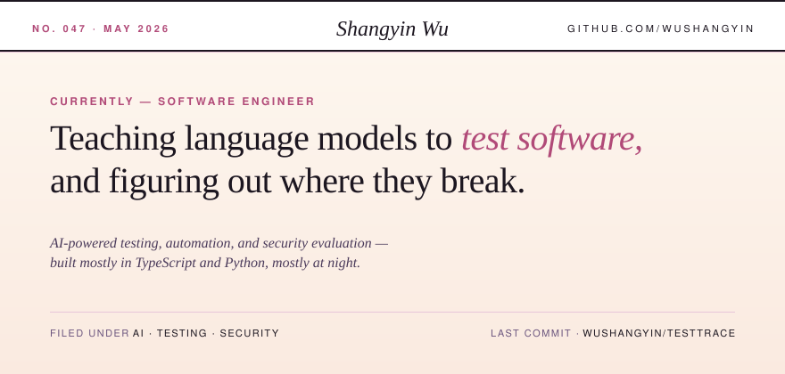
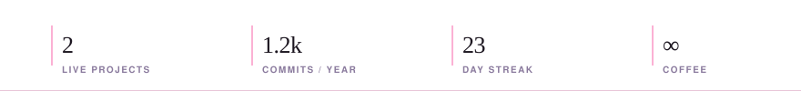
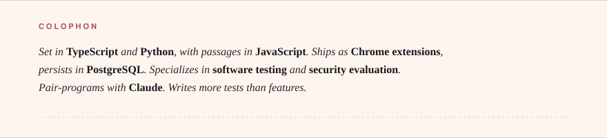

  

 

> ### Editor's note
>
> My day-to-day sits at the intersection of two things that don't always get along — software testing, which wants to be deterministic, and large language models, which mostly aren't. Most of what I build is an attempt to make that interaction useful: agents that drive browsers, evaluators that catch silent regressions, and the occasional security probe that finds something the test suite missed. I write code in TypeScript and Python, ship Chrome extensions, and keep most of the state in PostgreSQL. Powered, in no small part, by Claude.

 

  

 

### The workshop — what I'm building right now

<table>
  <tr>
    <td valign="top" width="120">
      <em>01</em> 
      CHROME EXT. + PLATFORM
    </td>
    <td valign="top">
      <h4><a href="https://github.com/Wushangyin/TestTrace">TestTrace</a></h4>
      FUNCTIONAL TESTING AUTOMATION
      
A Chrome extension that records the way real people actually click through a product, paired with a platform that turns those traces into reproducible tests. Designed so QA engineers spend less time writing selectors and more time deciding what's worth testing.

    </td>
  </tr>
  <tr>
    <td valign="top" width="120">
      <em>02</em> 
      PYTHON SERVICE
    </td>
    <td valign="top">
      <h4><a href="https://github.com/Wushangyin/EstiMate">EstiMate</a></h4>
      SOFTWARE COST ESTIMATION
      
A pricing tool for software projects — structured inputs, transparent breakdowns, defensible numbers. The kind of estimate you can hand to a client without flinching.

    </td>
  </tr>
</table>

 

  

  
  
  
  
  
  
  
  

 

  

  <h3><em>Correspondence welcome.</em></h3>

  
  
  
  

    

  <em>No. 047 · printed in pixels · revised on every push</em>

